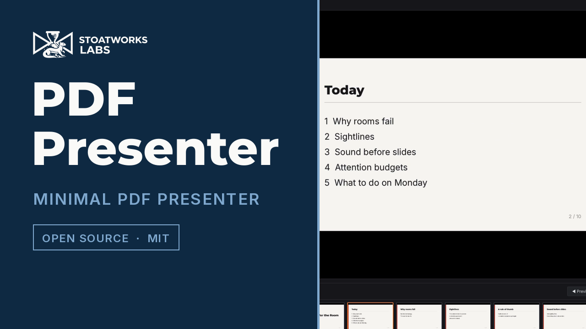
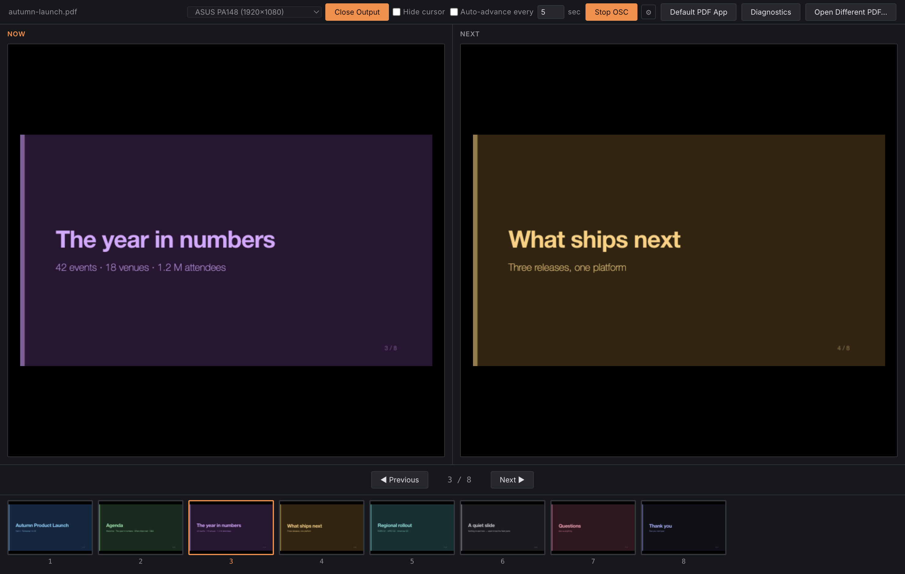
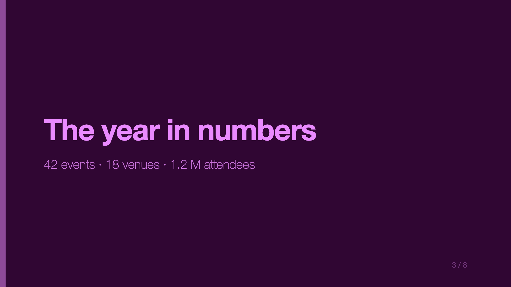
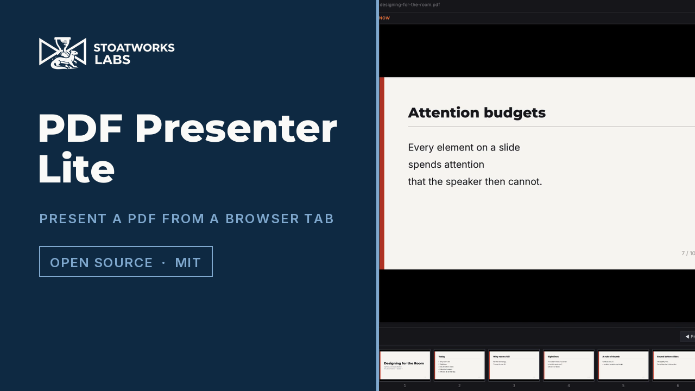

# PDF Presenter

> **AI-assisted project.** This codebase was created with [Claude](https://claude.com/claude-code)
> (Anthropic), directed and reviewed by a human author — including architecture,
> implementation, and documentation. Review it accordingly before relying on it in
> production.

A minimal, single-purpose presenter tool: open a PDF, get a presenter view on one
screen (Now/Next preview plus a clickable slide thumbnail strip) and a clean
fullscreen output on a second screen — no notes panel, no NDI, no network
integrations. A stripped-down sibling of
[presentation-commander-client](https://github.com/stoatworks-labs/presentation-commander-client),
keeping only its proven pdf.js rendering pipeline and multi-window/display-picker
pattern.

It ships in two forms, from this one repo. **PDF Presenter** is the desktop app —
the whole feature set, including OSC and the desktop integrations. **PDF Presenter
Lite** is the hosted build at
[pdf-presenter-lite.stoatworks-labs.com](https://pdf-presenter-lite.stoatworks-labs.com):
the same presenter view in a browser tab with nothing to install, minus the parts a
web page cannot do. The "lite" is that difference, and nothing else — the two share
their entire UI.

[](https://www.youtube.com/watch?v=pKzqgFt-Tco)

*A 38-second tour. Every frame is the real application presenting a real PDF, driven
over its own OSC control surface.*





<!-- downloads:start -->

## Download

**[v1.3.1](https://github.com/stoatworks-labs/pdf-presenter/releases/tag/v1.3.1)** — prebuilt for macOS, Windows and Linux. Pick your platform:

<details>
<summary><b>macOS</b> — Universal (Apple Silicon + Intel), Apple Silicon, Intel</summary>

| Build | Download | Size |
| --- | --- | --- |
| Universal (Apple Silicon + Intel) · .dmg disk image | [`pdf-presenter-1.4.0-universal.dmg`](https://github.com/stoatworks-labs/pdf-presenter/releases/download/v1.4.0/pdf-presenter-1.4.0-universal.dmg) | 205 MB |
| Apple Silicon · .dmg disk image | [`pdf-presenter-1.4.0-arm64.dmg`](https://github.com/stoatworks-labs/pdf-presenter/releases/download/v1.4.0/pdf-presenter-1.4.0-arm64.dmg) | 116 MB |
| Intel · .dmg disk image | [`pdf-presenter-1.4.0-x64.dmg`](https://github.com/stoatworks-labs/pdf-presenter/releases/download/v1.4.0/pdf-presenter-1.4.0-x64.dmg) | 123 MB |
| Universal (Apple Silicon + Intel) · .pkg installer | [`pdf-presenter-lite-1.4.0-macos-universal.pkg`](https://github.com/stoatworks-labs/pdf-presenter/releases/download/v1.4.0/pdf-presenter-lite-1.4.0-macos-universal.pkg) | 206 MB |
| Apple Silicon · .pkg installer | [`pdf-presenter-lite-1.4.0-macos-arm64.pkg`](https://github.com/stoatworks-labs/pdf-presenter/releases/download/v1.4.0/pdf-presenter-lite-1.4.0-macos-arm64.pkg) | 116 MB |
| Intel · .pkg installer | [`pdf-presenter-lite-1.4.0-macos-x64.pkg`](https://github.com/stoatworks-labs/pdf-presenter/releases/download/v1.4.0/pdf-presenter-lite-1.4.0-macos-x64.pkg) | 123 MB |
| Universal (Apple Silicon + Intel) · .zip archive | [`PDF.Presenter-1.4.0-universal-mac.zip`](https://github.com/stoatworks-labs/pdf-presenter/releases/download/v1.4.0/PDF.Presenter-1.4.0-universal-mac.zip) | 199 MB |
| Apple Silicon · .zip archive | [`PDF.Presenter-1.4.0-arm64-mac.zip`](https://github.com/stoatworks-labs/pdf-presenter/releases/download/v1.4.0/PDF.Presenter-1.4.0-arm64-mac.zip) | 112 MB |
| Intel · .zip archive | [`PDF.Presenter-1.4.0-mac.zip`](https://github.com/stoatworks-labs/pdf-presenter/releases/download/v1.4.0/PDF.Presenter-1.4.0-mac.zip) | 119 MB |

</details>

<details>
<summary><b>Windows</b> — x64 & ARM64, x64, ARM64</summary>

| Build | Download | Size |
| --- | --- | --- |
| x64 & ARM64 · .exe installer | [`pdf-presenter-1.4.0-setup.exe`](https://github.com/stoatworks-labs/pdf-presenter/releases/download/v1.4.0/pdf-presenter-1.4.0-setup.exe) | 206 MB |
| x64 · .exe installer | [`pdf-presenter-1.4.0-x64-setup.exe`](https://github.com/stoatworks-labs/pdf-presenter/releases/download/v1.4.0/pdf-presenter-1.4.0-x64-setup.exe) | 105 MB |
| ARM64 · .exe installer | [`pdf-presenter-1.4.0-arm64-setup.exe`](https://github.com/stoatworks-labs/pdf-presenter/releases/download/v1.4.0/pdf-presenter-1.4.0-arm64-setup.exe) | 101 MB |
| x64 & ARM64 · portable .exe | [`pdf-presenter-1.4.0-portable.exe`](https://github.com/stoatworks-labs/pdf-presenter/releases/download/v1.4.0/pdf-presenter-1.4.0-portable.exe) | 206 MB |
| x64 · portable .exe | [`pdf-presenter-1.4.0-x64-portable.exe`](https://github.com/stoatworks-labs/pdf-presenter/releases/download/v1.4.0/pdf-presenter-1.4.0-x64-portable.exe) | 105 MB |
| ARM64 · portable .exe | [`pdf-presenter-1.4.0-arm64-portable.exe`](https://github.com/stoatworks-labs/pdf-presenter/releases/download/v1.4.0/pdf-presenter-1.4.0-arm64-portable.exe) | 101 MB |

</details>

<details>
<summary><b>Linux</b> — x64, ARM64</summary>

| Build | Download | Size |
| --- | --- | --- |
| x64 · .deb package (Debian/Ubuntu) | [`pdf-presenter_1.4.0_amd64.deb`](https://github.com/stoatworks-labs/pdf-presenter/releases/download/v1.4.0/pdf-presenter_1.4.0_amd64.deb) | 94 MB |
| ARM64 · .deb package (Debian/Ubuntu) | [`pdf-presenter_1.4.0_arm64.deb`](https://github.com/stoatworks-labs/pdf-presenter/releases/download/v1.4.0/pdf-presenter_1.4.0_arm64.deb) | 89 MB |
| x64 · .rpm package (Fedora/RHEL) | [`pdf-presenter-1.4.0.x86_64.rpm`](https://github.com/stoatworks-labs/pdf-presenter/releases/download/v1.4.0/pdf-presenter-1.4.0.x86_64.rpm) | 80 MB |
| ARM64 · .rpm package (Fedora/RHEL) | [`pdf-presenter-1.4.0.aarch64.rpm`](https://github.com/stoatworks-labs/pdf-presenter/releases/download/v1.4.0/pdf-presenter-1.4.0.aarch64.rpm) | 76 MB |

</details>

All builds, checksums and release notes: [github.com/stoatworks-labs/pdf-presenter/releases](https://github.com/stoatworks-labs/pdf-presenter/releases).

These builds are unsigned, so macOS and Windows each warn once on first launch — see [Unsigned builds — Gatekeeper, SmartScreen & Defender Firewall](#unsigned-builds--gatekeeper-smartscreen--defender-firewall) for the one-time fix.

<!-- downloads:end -->

> **v1.3.1 predates the rename.** It was released as *PDF Presenter Lite*, so its
> files are named `pdf-presenter-lite-1.3.1-…` and it installs as
> `PDF Presenter Lite.app` / `PDF Presenter Lite.exe`. Everything below describes
> the app as it is now called; the next release carries the new name. The hosted
> build keeps the old name for good — see
> [Run it in a browser](#run-it-in-a-browser-with-nothing-installed--pdf-presenter-lite).

## What it does

- **Open a PDF** — renders locally with pdf.js, no other slide-source integrations
- **Presenter view** — a "Now" and "Next" preview side by side, plus a horizontal
  strip of thumbnails for every slide below them; click any thumbnail to jump
  straight to that slide
- **Keyboard navigation** — Left/Right, Up/Down, and Page Up/Page Down all
  move a slide; Space also advances. The same keys work whether the presenter
  view or the fullscreen Output window has focus, so a presentation clicker
  keeps working on a single-display machine, or after a stray click moves
  focus to the Output window
- **Mouse navigation** — a Previous/Next transport bar below the thumbnail
  strip, and clicking the "Next" preview itself jumps straight to it
- **Internal PDF link navigation** — links authored into the PDF itself (a
  table of contents, "back to agenda" links exported from PowerPoint/Keynote/
  Google Slides) become clickable on the "Now" slide, jumping straight to
  their target page. Reads link annotations via pdf.js, resolving each
  destination to a page number regardless of whether it's a named or explicit
  destination; only internal same-document links are wired up, external URLs
  are left alone
- **Fullscreen Output window** — a second, chrome-free window showing just the
  current slide, for a projector or confidence monitor. Pick which connected
  display it opens on from a dropdown next to the toggle button. The two
  windows carry distinct names in the window switcher — "PDF Presenter —
  Control" and "PDF Presenter — Output (<display>)"
- **Screen blanking** — press `B` or `W` to cut the Output window to solid
  black or white without losing your place, mirroring PowerPoint's presenter
  shortcuts; press again to restore the slide
- **Hide cursor on Output** — an optional checkbox that hides the OS mouse
  cursor whenever it's over the Output window, for a clean audience-facing
  display
- **OSC control** — a UDP OSC address space (slide navigation, black/white,
  Output open/close, system enable/disable) at `/pdfpresenter/...`, plain
  UDP rather than a Windows COM add-in, so it works on every platform this
  app ships for. A real Bitfocus Companion module ships alongside this app
  — [companion-module-pdf-presenter-lite](https://github.com/stoatworks-labs/companion-module-pdf-presenter-lite)
  — for driving it from a Stream Deck or any other Companion surface. An
  optional, off-by-default "watched folder" feature lets OSC open a
  specific PDF by filename without a dialog — useful for a button wall
  that loads a specific deck on cue. Sections are mapped from the PDF's
  own top-level outline/bookmarks — `goto/section` jumps straight to one.
  `/pdfpresenter/slideshow/laserpointer` mirrors the presenter's mouse
  position over the "Now" preview onto the Output window as a glowing dot,
  matching PowerPoint's own laser-pointer feature.
  `/pdfpresenter/slideshow/setwallpaper` renders the current slide and
  sets it as the desktop wallpaper on every connected monitor — macOS and
  Windows are fully covered, Linux is GNOME-only
- **Timed auto-advance** — an optional "advance every N seconds" mode
  (stops at the last slide rather than looping), with its own play/pause
  control next to the OSC settings — `/pdfpresenter/slideshow/pause` and
  `/resume` suspend/resume it remotely once it's turned on
- **Set as Default PDF App** — a titlebar button for making double-clicking
  a PDF open straight into this app. What it actually does differs by OS,
  since neither Windows nor macOS let a third-party app silently seize the
  default-app slot: on Windows it registers the app as a candidate then
  opens Settings for you to confirm; on macOS it registers with Launch
  Services and sets the default directly if `duti` is installed
  (`brew install duti`), otherwise shows the real manual steps; on Linux
  it's fully automatic via `xdg-mime`. The status message always says
  what actually happened, never a fake "done" when the real answer is
  "you still need to confirm it"

## Run it in a browser, with nothing installed — *PDF Presenter Lite*

Everything above renders with pdf.js — the desktop app was never doing that part
natively — so the presenter view works just as well as a **hosted web app** with
no backend at all. Build it with `npm run static:build` and publish the result as
static assets (a Cloudflare Worker, in this project's case).

This build calls itself **PDF Presenter Lite**: the name is the capability
difference in the table below, and it is the name the app shows in its own
titlebar, so an operator can tell at a glance which one is on the screen.

**Your PDF is never uploaded.** There is no server and no upload endpoint: the
file is read by the page from your own disk, and the deck, the thumbnails and the
Output window all stay inside your browser. Live at
**[pdf-presenter-lite.stoatworks-labs.com](https://pdf-presenter-lite.stoatworks-labs.com)**.

[](https://www.youtube.com/watch?v=5gxPD5JmbzU)

*A 47-second tour of the hosted build, filmed at that address: a deck opened from
disk, Now and Next, the thumbnail strip, then the Output window on top of it. The
deck is generated for these videos, so nobody else's slides appear in it.*

| | Desktop app | Browser |
|---|---|---|
| Presenter view, thumbnails, transport | ✅ | ✅ |
| Fullscreen Output window | ✅ chosen display, opened fullscreen | ✅ popup you place, click to fullscreen |
| Keyboard / clicker, incl. from the Output window | ✅ | ✅ |
| Screen blanking, laser pointer, hide cursor | ✅ | ✅ |
| Internal PDF links, sections, auto-advance | ✅ | ✅ |
| **OSC control** (+ Companion module) | ✅ | ❌ |
| **Watched folder** | ✅ | ❌ |
| Set as default PDF app, wallpaper export | ✅ | ❌ |
| Diagnostics bundle | ✅ | ❌ |

The exclusions are all the same limitation: a web page has no UDP socket, no
path-addressable filesystem, and no authority over the desktop it runs on. The UI
hides those controls in the browser build rather than showing buttons that cannot
work. **If you drive the show from a Stream Deck, use the desktop app.**

Two differences worth knowing about the browser Output window. It opens as a
**pop-up**, so allow pop-ups for the site. And it opens as a normal window
rather than fullscreen: only a gesture inside a window can make that window
fullscreen, so it shows a "Click for fullscreen" prompt, and that click is
unavoidable — nothing the opener does can stand in for it.

On Chromium it puts itself on your second display, which needs the Window
Management permission; refuse it and the window simply opens where the browser
would have put it and you move it yourself. Either way the click is the same.

## Architecture

Two renderer views loaded from the same bundle, selected by a `mode` query param
(mirrors the Client Node's Program Out window pattern):

- `App.tsx` — the presenter view: loads the PDF, owns `currentPage`/`totalPages`,
  renders Now/Next + thumbnails, and pushes `{ data, currentPage }` to the Output
  window whenever it changes.
- `Output.tsx` — the fullscreen window. Pulls the current state via
  `output:get-state` once its own listener is mounted (rather than relying solely
  on a live push, which can race and get silently dropped if the window is still
  loading when the presenter pushes) and then stays in sync via `output:state`
  pushes for as long as it's open.

`pdf.ts` (the PDF loading/rendering helpers) is copied verbatim from
presentation-commander-client — same render-queue-per-canvas serialization to
avoid the transform-corruption bug documented there.

Both views talk to one interface, `PresenterApi` in
[`src/shared/api.ts`](src/shared/api.ts), and two backends implement it:

- [`src/preload/index.ts`](src/preload/index.ts) — the Electron IPC bridge.
- [`src/web/browserApi.ts`](src/web/browserApi.ts) — the hosted build. The
  Output window is a `window.open` pop-up and the two windows talk over a
  `BroadcastChannel`, which stands in for everything the main process does
  between them: forwarding state and laser position, relaying transport keys
  pressed while the Output has focus, and holding the last state so an Output
  that finishes loading after a push can pull it (the race called out above).

Each backend declares what it can do through `capabilities`, and the components
branch on that — **never on "is this Electron"**.

## Status

**Field proven** — this has been run on real events, not just verified on the
bench.

Before that, it was built and verified end-to-end: opening a PDF,
thumbnail-click navigation, arrow-key navigation, and the fullscreen Output
window (including a real race condition in the initial state hand-off, found and
fixed during testing) all confirmed working against a real multi-page PDF.

**The browser build is newer and has not been run on an event**, but it has been
verified on a dual-display setup. Against a real multi-page PDF: the deck loads
and renders, the presenter view and thumbnails work, state and laser position
reach a separate Output window, transport keys pressed in the Output window
drive the control window, an Output window loaded *after* a push pulls the
current state, and the Output window opens **on the second display** by itself.

It opens there as a normal window, not fullscreen — that part is one click, and
has to be. Fullscreen can only be entered by a gesture inside the window that is
going fullscreen, so no amount of work in the opener can skip it; the prompt in
the Output window is that gesture.

## Inspiration & prior art

This app's OSC control feature (and, indirectly, its wallpaper-export
feature) was shaped by looking at how existing remote-PowerPoint-control
tools work. None of their code is reused here — this app has no PowerPoint
dependency at all, and two of the three are closed-source anyway — but it's
worth being upfront about where the ideas came from:

- **[OSCPoint](https://github.com/phuvf/oscpoint)** — a Windows PowerPoint
  add-in exposing an OSC API. It's closed-source, so nothing was copied from
  it; its public documentation (`ACTIONS.md`/`FEEDBACKS.md`/`EVENTS.md`) was
  read to design a comparable address space and the two-port
  (action-in/feedback-out) architecture this app uses. That address space
  originally mirrored OSCPoint's own (`/oscpoint/...`, matching ports) for
  drop-in Companion compatibility; it's since been renamed to
  `/pdfpresenter/...` and decoupled from OSCPoint entirely, now that this app
  has its own dedicated Companion module instead.
- **[Iris Down Remote Show Control](https://irisdown.co.uk/rsc.html)** — an
  older, separate commercial PowerPoint add-in taking plain ASCII text
  commands (`NEXT`, `PREV`, `GO`, `RUNCURRENT`, `SETBG`, …) over UDP/TCP,
  with no feedback channel at all. Its command set overlaps conceptually
  with several features here — slide navigation, starting from the current
  slide, and notably `SETBG`'s "set desktop wallpaper to the current slide,"
  which this app's own wallpaper-export feature does the same thing as.
  Nothing was read from its source (it isn't public) or its wire format
  (plain text vs. this app's OSC) — the overlap is in feature scope, not
  implementation.

## Project Setup

### Install

```bash
npm install
```

### Development

```bash
npm run dev
```

### Build

```bash
npm run build
npm run build:mac   # or build:win / build:linux
```

### Hosted (browser) target

```bash
npm run preview:static   # vite dev server on :5185, no backend
npm run static:build     # production build into out-static/
npm run deploy:static    # build, then publish the Worker (needs Cloudflare creds)
```

The Output window is `/?mode=output` — the same URL the pop-up opens.

## Unsigned builds — Gatekeeper, SmartScreen & Defender Firewall

The release binaries are **not code-signed or notarized** — that needs paid Apple
and Microsoft developer certificates this project doesn't carry. The downloads are
fine; the OS just can't identify the publisher, so it warns you the first time.

- **macOS** — *"cannot be opened because the developer cannot be verified"*.
  Right-click the app → **Open** → **Open**, or clear the flag:
  `xattr -dr com.apple.quarantine "/Applications/PDF Presenter.app"`
- **Windows** — SmartScreen shows *"Windows protected your PC"* →
  **More info** → **Run anyway**.
- **Windows Defender Firewall** — first launch pops *"Allow PDF Presenter to
  communicate on these networks"*. Tick **Private** (and **Domain** on a managed
  network) — PDF Presenter needs it to receive OSC from Bitfocus Companion. Deny it
  and Companion buttons will appear to work but nothing will happen.
- **Linux** — no signing gate.

Per-artifact steps, self-signing, checksum verification and the Defender Firewall reset
procedure: **[docs/UNSIGNED.md](docs/UNSIGNED.md)**.
